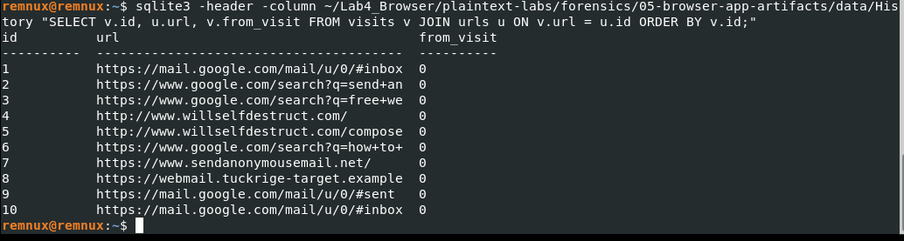

# Digital Forensics – Lab 4: Browser Forensics

## Objective

To investigate browser artefacts from a Chrome History SQLite database and reconstruct browsing activity, search behaviour, downloads, and a chronological sequence of web visits.

## Tools Used

- REMnux
- SQLite3
- Chrome History SQLite database
- Linux terminal

## Evidence Analysed

The primary evidence analysed was the Chrome `History` SQLite database.

The database contained the following tables:

- `urls`
- `visits`
- `downloads`
- `keyword_search_terms`
- `meta`

## Analysis Performed

### 1. Browser History

The `urls` table was examined to identify recorded websites, page titles, visit counts and typed URL counts.

Recorded activity included:

- Gmail Inbox
- Google searches related to anonymous email
- Google searches related to hiding an IP address while sending email
- WillSelfDestruct website
- WillSelfDestruct compose page
- SendAnonymousEmail website
- Target webmail page
- Gmail Sent Mail

### 2. Search Terms

The `keyword_search_terms` table was examined to identify searches recorded by Chrome.

Recovered searches included:

- `send anonymous email without being traced`
- `free webmail no phone number required`
- `how to hide my ip address sending email`

### 3. Browser Timeline

Chrome timestamps were converted into UTC to reconstruct the chronological sequence of browser activity.

The recorded activity occurred on **15 March 2024 between 02:00 and 02:33 UTC**.

### 4. Detailed Visit Analysis

The `visits` table was joined with the `urls` table to reconstruct the chronological browsing sequence.

The recovered sequence was:

- 02:00 – Gmail Inbox
- 02:03 – Search for anonymous email
- 02:05 – Search for free webmail
- 02:07 – WillSelfDestruct
- 02:09 – WillSelfDestruct compose page
- 02:12 – Search about hiding an IP address when sending email
- 02:15 – SendAnonymousEmail
- 02:18 – Target webmail page
- 02:25 – Gmail Sent Mail
- 02:33 – Gmail Inbox

### 5. Downloads

The `downloads` table contained one recorded download.

The downloaded file was:

- Filename: `anon_mailer.exe`
- Path: `C:\Users\jsmith\Downloads\anon_mailer.exe`
- Source: `https://pastebin.com`
- Size: `184832` bytes
- MIME type: `application/octet-stream`

### 6. Navigation Relationships

The `from_visit` field was examined to identify relationships between recorded browser visits.

The `transition` field was also examined as part of the browser artefact analysis.

## Key Findings

The Chrome History database recorded a sequence of activity involving:

1. Gmail access
2. Searches related to anonymous email
3. Searches related to hiding an IP address
4. Access to an anonymous email website
5. Access to a target webmail page
6. Gmail Sent Mail
7. A recorded download of `anon_mailer.exe`

The browser evidence provides a chronological view of the recorded activity between **02:00 and 02:33 UTC on 15 March 2024**.

## Forensic Interpretation

The browser artefacts show a sequence of activity related to anonymous email services followed by access to a target webmail page and Gmail Sent Mail.

The presence of the `anon_mailer.exe` download is an additional artefact that may be relevant to the investigation.

However, browser history and download records alone do not prove that an email was successfully sent or establish malicious intent. Additional artefacts would be required to confirm the user's actions and determine the purpose of the downloaded file.

## Conclusion

This investigation demonstrated how Chrome browser artefacts can be used to reconstruct user activity, recover search terms, identify downloads, and establish a chronological sequence of browser visits.

The exercise also demonstrated the importance of correlating multiple artefacts rather than relying on a single browser-history record when drawing forensic conclusions.

## Evidence

### Evidence Screenshot 1 – Browser History

### Evidence Screenshot 2 – Search Terms

### Evidence Screenshot 3 – Browser Timeline

### Evidence Screenshot 4 – Visit Relationships

### Evidence Screenshot 5 – Download Evidence

