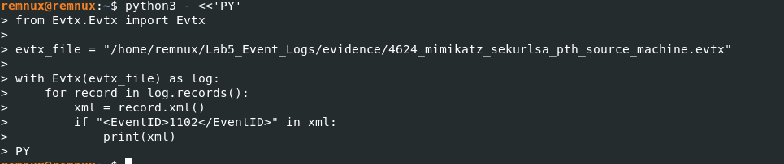
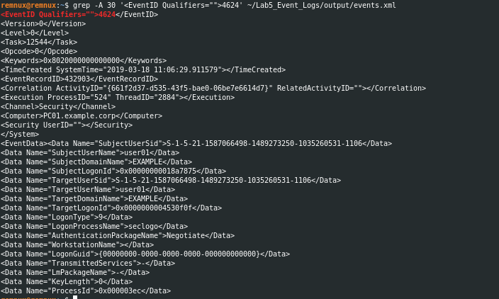
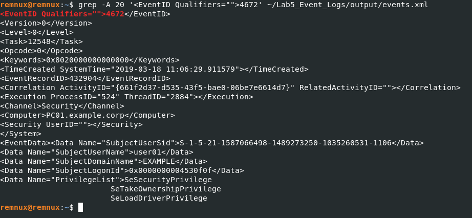
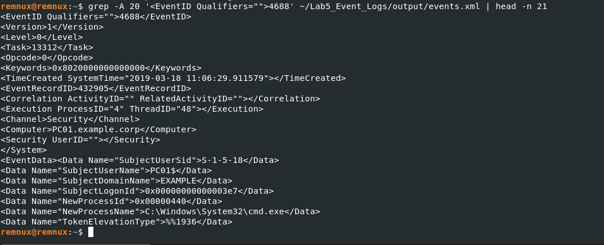
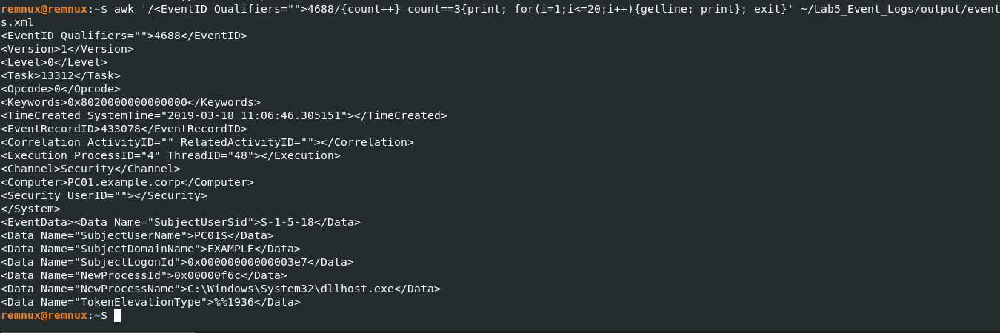

# Lab 5 – Windows Event Log Forensics

## Objective

The objective of this lab was to investigate Windows Event Log artefacts from an EVTX file and identify security-relevant events, user activity, privilege assignments, and process creation.

## Tools Used

- REMnux
- Python
- python-evtx
- Linux Terminal
- Windows EVTX sample

## Evidence Analysed

**EVTX File:**

`4624_mimikatz_sekurlsa_pth_source_machine.evtx`

The EVTX file was parsed using the Python `python-evtx` library.

## Analysis Performed

The investigation focused on the following Windows Security Event IDs:

- **1102** – Security audit log was cleared
- **4624** – Successful logon
- **4672** – Special privileges assigned to a new logon
- **4688** – Process creation

The events were extracted from the EVTX file and correlated chronologically to understand the sequence of activity.

## Key Findings

### Event ID 1102 – Security Log Cleared

The Windows Security audit log was cleared on:

`PC01.example.corp`

Timestamp:

`2019-03-18 11:06:25.485214`

Recorded subject:

`EXAMPLE\user01`

### Event ID 4624 – Successful Logon

A successful Logon Type 9 (NewCredentials) event was recorded for:

`EXAMPLE\user01`

Timestamp:

`2019-03-18 11:06:29.911579`

### Event ID 4672 – Special Privileges

The same user was associated with special privileges including:

- SeSecurityPrivilege
- SeTakeOwnershipPrivilege
- SeLoadDriverPrivilege
- SeBackupPrivilege
- SeRestorePrivilege
- SeDebugPrivilege
- SeSystemEnvironmentPrivilege
- SeImpersonatePrivilege

### Event ID 4688 – Process Creation

The investigation identified process creation events involving:

`C:\Windows\System32\cmd.exe`

and

`C:\Windows\System32\dllhost.exe`

A `conhost.exe` process was also present in the original EVTX data.

## Timeline Correlation

The Security audit log was cleared approximately 4.4 seconds before the successful logon event.

The 4624, 4672 and first 4688 events were recorded at the same timestamp.

This sequence is suspicious and warrants further investigation. However, these events alone do not prove malicious activity or malicious intent.

## Forensic Interpretation

The combination of Security log clearing, a Logon Type 9 event, assignment of powerful privileges, and subsequent process creation represents activity that would require further forensic investigation.

The evidence should be interpreted in context and correlated with additional artefacts rather than being treated as proof of compromise.

## Limitations

This analysis is based on the available events in the selected EVTX sample.

A complete investigation would require additional evidence such as:

- Other Windows Event Logs
- Process command-line information
- Network activity
- Endpoint artefacts
- File-system artefacts
- Authentication and account activity

## Evidence

### Event ID 1102 – Security Log Cleared

### Event ID 4624 – Successful Logon

### Event ID 4672 – Special Privileges

### Event ID 4688 – CMD Process Creation

### Event ID 4688 – DLLHOST Process Creation

## Conclusion

This lab demonstrated how Windows Event Logs can be used to reconstruct security-relevant activity and correlate events into a forensic timeline.

It also highlighted the importance of analysing multiple event types together and avoiding conclusions based on a single artefact.
