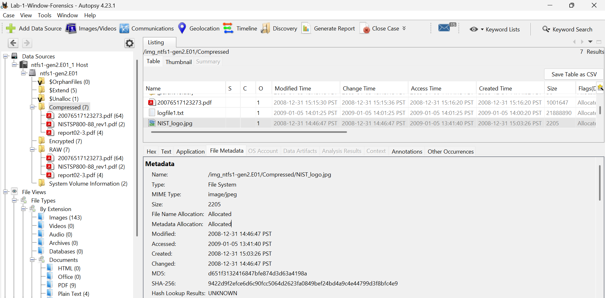

# 🔍 Digital Forensics Lab

Welcome to my Digital Forensics portfolio.

This repository documents my hands-on learning journey in Digital Forensics and Incident Response (DFIR). I use this space to record practical labs, investigations, tools, methodologies, and findings as I develop my skills for a career in digital forensics.

## 🎯 Topics I Plan to learn

- Windows Forensics
- File System Analysis
- Windows Registry Analysis
- Event Log Analysis
- Disk & File Analysis
- Memory Forensics
- Incident Response
- Evidence Handling & Documentation

## 🛠️ Tools I plan to learn & Practice 

- Autopsy
- FTK Imager
- Volatility
- Registry Explorer
- Windows Event Viewer
- Wireshark

## 🧪 Labs & Investigations

Hands-on investigations and case reports will be added here as I complete them.

### 🔍 Lab 01 – Windows Disk Image Analysis with Autopsy

**Objective:**  
Perform a basic forensic examination of an NTFS disk image using Autopsy and document key evidence discovered during the investigation.

**Evidence Source:**  
- Disk image: `ntfs1-gen2.E01`
- Host: `ntfs1-gen2.E01_1 Host`

**Tool Used:**  
- Autopsy 4.23.1

**Key Findings:**  
- Images identified: **143**
- PDF files identified: **9**
- Plain text files identified: **4**
- Examined NTFS areas including `$Unalloc`, `$Extend`, Compressed, Encrypted, RAW, and System Volume Information
- Reviewed file metadata, timestamps, MIME/file types, and file contents
- Examined `NIST_logo.jpg` metadata and hash information
- Inspected unallocated space using the Hex viewer

**Skills Practiced:**  
- Disk image examination
- NTFS file-system analysis
- File-type identification
- Metadata and timestamp analysis
- Hash examination
- Unallocated-space inspection
- Digital evidence documentation

## 📚 Learning Goals

My goal is to build practical DFIR skills by investigating realistic scenarios, analysing digital evidence, documenting findings, and producing professional forensic reports.

## 📈 Portfolio Progress

This repository will be continuously updated as I complete new labs, projects, and investigations. 
### Evidence Screenshot

